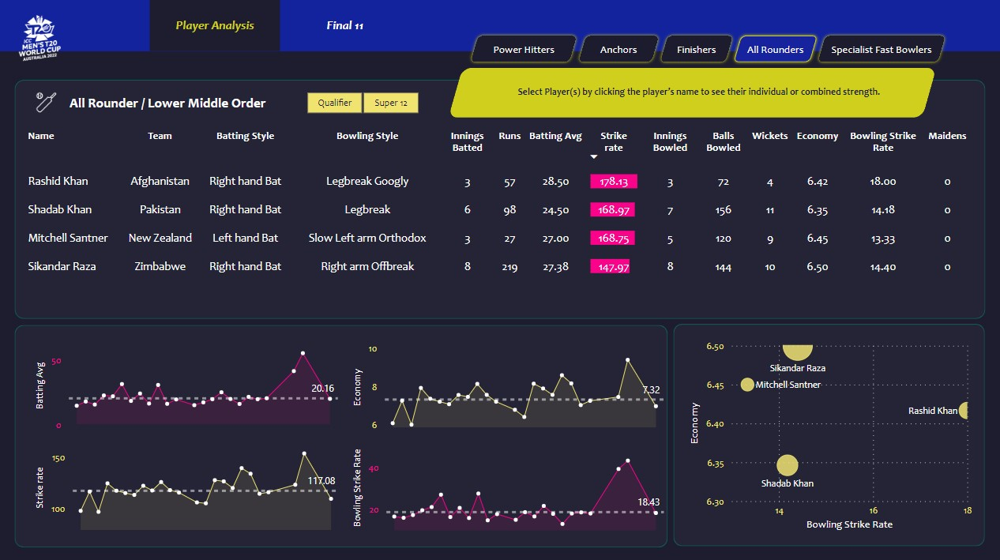

# Cricket Best XI Analysis🏏

---

This project focuses on web scraping T20 World Cup 2022 data from ESPN Cricinfo using Bright Data, Python, and Pandas. As a data analyst, you'll transform and clean the data, then create a Power BI dashboard to identify the best-performing players. Key tasks include extracting data, visualizing player statistics, and providing insights for informed team selection. The dashboard aids decision-makers in choosing the best 11 players based on comprehensive data analysis, enhancing your technical and analytical skills.
• Scraped 10,000+ rows of player data from ESPN cricinfo using Bright 
Data for T20 World Cup 2022 analysis. 
• Cleaned and transformed 100,000+ data points using Pandas to ensure 
accurate player performance metrics. 
• Created interactive Power BI dashboards visualizing 20+ key statistics, 
identifying top-performing players. 
• Analyzed performance data of 100+ players to determine the optimal 
11-player team combination across all participating countries. 

> To interact with the dashboard you can download the pbix file from the repository and open it in Power BI Desktop locally.

---

# Steps involved in the project:

1. 📝Requirement Scoping
2. 🌐Data Collection using Web Scraping from [ESPN Cricinfo](http://www.espn.in/cricket/) website
3. 🧹Data Cleaning and Preprocessing in Pandas
4. 🪄Data Transformation in Power Query
5. ⚒️Data Modelling and Building Parameters in Power BI using DAX
6. 📊Building the Dashboard in Power BI

---

# Screenshots of the Dashboard:

